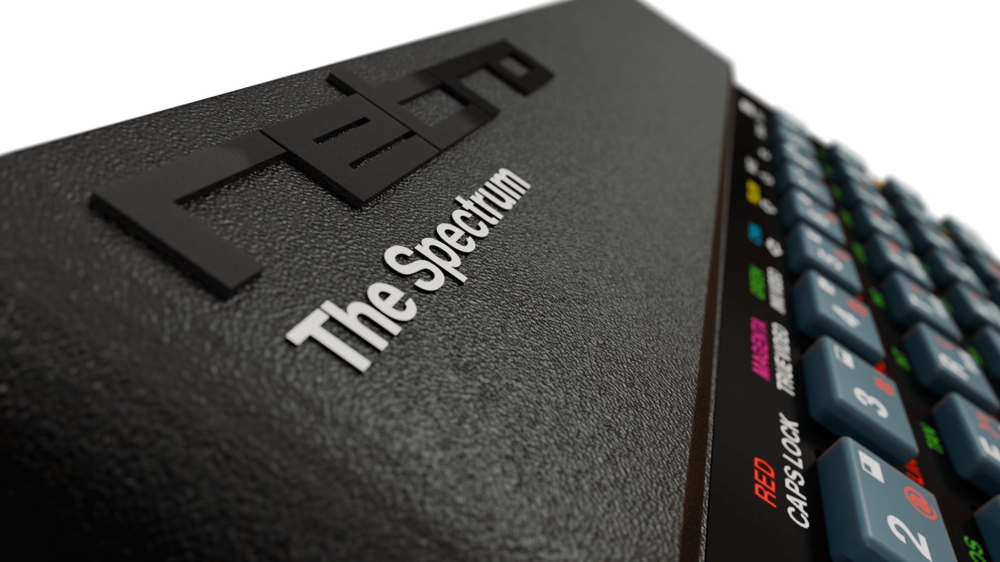

ZX Spectrum TOSEC Utility Script

A shell script to convert the [TOSEC](https://archive.org/details/zx_spectrum_tosec_set_september_2023) collection of ZX Spectrum games into a structure suitable for use with [The Spectrum](https://retrogames.biz/products/thespectrum/) games console.

## Running The Script

- Clone this repo
- Download the latest from [TOSEC](https://archive.org/details/zx_spectrum_tosec_set_september_2023) [Games.zip](https://archive.org/download/zx_spectrum_tosec_set_september_2023/Games.zip) and unzip it into the repo folder
- Run `./zx-spectrum-tosec-util.sh 2>/dev/null`

This will move the game files with supported extensions (tap, tzx, pzx, rom, szx, z80, sna, m3u) into a compatible folder structure under `/THESPECTRUM` directory. As The Spectrum only supports up to 256 files per folder the games are split alphabetically (#, A...Z) and numerically (A0...A3).

Copy THESPECTRUM folder to a suitable USB, plug in to [The Spectrum](https://www.youtube.com/watch?v=EnfQ13nFJYc) & enjoy!
